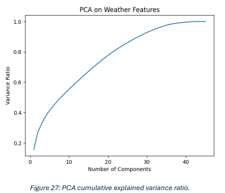
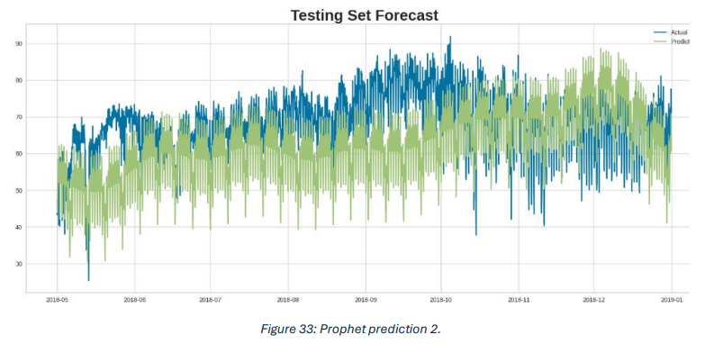
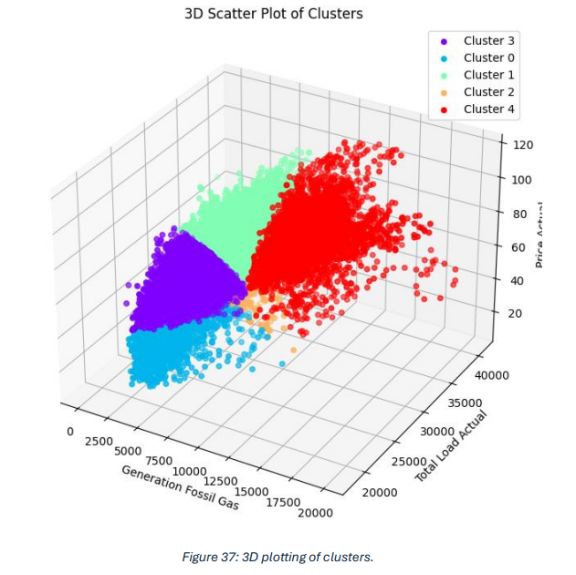

# Energy Market Forecasting and Market State Clustering

An end-to-end machine learning pipeline for forecasting Spanish electricity prices and identifying market states using multi-source time series data, feature engineering, and unsupervised learning.

## Overview

This project explores electricity price forecasting in the Spanish energy market using hourly energy generation, grid load, and weather data. The work combines data preprocessing, exploratory analysis, feature engineering, supervised forecasting, and unsupervised clustering to better understand both **future price behavior** and **market operating states**.

The system was built on historical hourly data from Spain covering multiple years and focuses on two practical goals:

- forecasting short-term electricity prices
- identifying recurring market states such as peak, off-peak, and transitional demand conditions

This project is especially relevant to energy economics, grid operations, and data-driven decision support in markets affected by seasonality, weather, and changing generation sources.

## Objectives

- clean and merge energy and weather datasets from multiple sources
- analyze seasonality, autocorrelation, and market behavior
- reduce redundant weather features while preserving useful information
- compare forecasting approaches for electricity price prediction
- cluster market conditions into interpretable operational states

## Dataset

The project uses the public Kaggle dataset:

- [Energy consumption, generation, prices and weather in Spain](https://www.kaggle.com/datasets/nicholasjhana/energy-consumption-generation-prices-and-weather)

### Data sources

#### 1. Energy dataset
Includes hourly variables such as:

- electricity price
- total grid load
- forecasted load
- generation by source:
  - fossil gas
  - coal
  - wind
  - solar
  - hydro
  - other generation categories

#### 2. Weather dataset
Includes hourly weather observations for five Spanish cities:

- Madrid
- Barcelona
- Valencia
- Seville
- Bilbao

Weather-related variables include:

- temperature
- pressure
- humidity
- wind speed
- rain
- weather description

## Pipeline

The full workflow follows this structure:

```text
Raw Energy Data + Raw Weather Data
                ↓
        Data Cleaning & Validation
                ↓
      Missing Value Handling / Interpolation
                ↓
   Weather Restructuring by City and Merging
                ↓
      Exploratory Data Analysis (EDA)
                ↓
  Seasonality / Trend / Correlation Analysis
                ↓
   Feature Engineering / Dimensionality Reduction
                ↓
 Forecasting Models + Market State Clustering
                ↓
      Evaluation, Interpretation, Insights
```

## Data Preparation

A large part of the project focused on making the dataset reliable enough for downstream machine learning tasks.

### Key preprocessing steps

- converted timestamp columns into proper datetime format
- removed irrelevant or fully invalid columns
- identified missing values across time series features
- filled missing values using interpolation where appropriate
- removed duplicated weather entries
- reshaped weather data by city to enable merging with energy data
- detected abnormal pressure values and corrected them using interpolation
- dropped redundant weather columns where multiple columns represented near-identical information

### Why this matters

Electricity market data is highly seasonal and continuous. Poor preprocessing leads to misleading models. This project treats preprocessing as a core engineering step rather than a minor cleanup stage.

## Exploratory Data Analysis

The EDA showed that the electricity dataset has strong temporal structure.

### Main findings

- strong autocorrelation with past values
- clear daily seasonality
- clear weekly seasonality
- signs of monthly behavioral shifts
- meaningful correlations between price, load, and generation sources

A particularly useful insight was that fossil-fuel-based generation, especially fossil gas, showed strong relationships with both electricity price and total grid load.

## Feature Engineering

To reduce redundancy in weather-related features, dimensionality reduction techniques were evaluated.

### Techniques tested

- PCA
- t-SNE
- UMAP

### Outcome

PCA was selected because it offered the best tradeoff between information retention and computational efficiency.

- PCA execution time was dramatically lower than t-SNE and UMAP
- dimensionality was reduced from **63 to 51 columns**
- **95% of variance** was preserved using 33 components

### Key insight

Dimensionality reduction improved computational efficiency, but it did **not significantly improve forecasting accuracy**. This was an important result because it showed that faster models do not automatically become better models.

## Forecasting Task

The forecasting objective was to predict electricity prices using historical market and weather variables.

### Models explored

- Prophet
- Croston
- benchmarked alternatives through PyCaret

### Evaluation metrics

- MAE
- RMSE
- MAPE
- R²

### Forecasting insights

- Prophet handled seasonality and trend structure better than simpler approaches
- tuning Prophet improved its metrics slightly
- dimensionality reduction did not materially improve Prophet’s forecasting performance
- Croston achieved superficially strong metrics but failed to capture seasonal behavior in visual forecasts

This was one of the most important lessons from the project:

> a model can look good numerically while still failing to represent real market dynamics

## Market State Clustering

In addition to forecasting, the project used clustering to identify recurring market states.

### Features used for clustering

- actual electricity price
- actual grid load
- fossil gas generation

These features were selected based on correlation analysis and their practical relevance to supply-demand behavior.

### Method

- K-Means clustering
- Elbow method for candidate cluster count
- silhouette score for validation

### Result

The optimal number of clusters was **5**, representing interpretable market states such as:

- off-peak, lower-demand periods
- transitional market conditions
- high-demand periods
- supply-constrained or price-sensitive states
- peak demand periods with strong fossil gas generation

### Why this matters

This adds a second layer of value beyond forecasting. Instead of only predicting future prices, the system also helps explain the structure of market behavior and identify recurring operational states.

## Results Summary

## Key Visuals

### PCA cumulative explained variance
This figure shows how PCA was used to reduce redundant weather features while preserving most of the information in the dataset.



### Prophet forecast on test data
This forecast compares predicted electricity prices against actual values on the test set and illustrates how the model captures recurring seasonal structure.



### Market state clustering
This 3D cluster plot shows how market conditions can be grouped into interpretable states using fossil gas generation, total load, and electricity price.



### Key outcomes

- built a multi-source time series pipeline using energy and weather data
- reduced redundant features while preserving most of the information
- improved Prophet performance through tuning
- found that dimensionality reduction improved efficiency more than accuracy
- showed that metric-only model selection can be misleading
- identified **5 interpretable market states** using unsupervised learning

## Repository Structure

A cleaner project structure is recommended for this repository:

```text
.
├── README.md
├── requirements.txt
├── notebooks/
│   ├── 01_energy_preprocessing.ipynb
│   ├── 02_weather_preprocessing.ipynb
│   ├── 03_feature_engineering.ipynb
│   ├── 04_price_forecasting.ipynb
│   └── 05_market_state_clustering.ipynb
├── assets/
│   ├── pipeline_diagram.png
│   ├── pca_variance.png
│   ├── prophet_forecast.png
│   └── cluster_plot.png
└── results/
    └── metrics_summary.csv
```

## How to Run

### 1. Clone the repository

```bash
git clone https://github.com/Galuyoo/Forecasting-electricity-prices-and-market-state..git
cd Forecasting-electricity-prices-and-market-state.
```

### 2. Create a virtual environment

```bash
python -m venv venv
source venv/bin/activate
```

On Windows:

```bash
venv\Scripts\activate
```

### 3. Install dependencies

```bash
pip install -r requirements.txt
```

### 4. Launch Jupyter

```bash
jupyter notebook
```

### 5. Run notebooks in order

Run the notebooks in the following sequence:

1. energy preprocessing
2. weather preprocessing
3. feature engineering
4. forecasting
5. clustering

## Technologies Used

- Python
- Pandas
- NumPy
- Matplotlib
- Seaborn
- Scikit-learn
- Prophet
- PyCaret
- Jupyter Notebook

## Engineering Takeaways

This project was not only about model training. It also highlighted several important engineering lessons:

- preprocessing quality strongly affects model usefulness
- time series models must be judged visually as well as numerically
- dimensionality reduction can improve efficiency without improving predictive quality
- clustering can complement forecasting by making market behavior more interpretable

## Future Improvements

Potential next steps for improving this project include:

- replacing notebook-heavy logic with reusable Python modules
- testing stronger forecasting models such as XGBoost-based lag pipelines or transformer-based time series methods
- adding external signals such as holidays, fuel prices, or renewable penetration rates
- packaging the project into a simple dashboard or API for interactive use
- improving experiment tracking and reproducibility

## Author

**Salaheddine Chouikh**  
MSc Artificial Intelligence

## Notes

Some preprocessing and forecasting implementation ideas were inspired by public Kaggle notebooks referenced in the report. The project extends those ideas through custom preprocessing, feature engineering decisions, forecasting analysis, and market state clustering.
